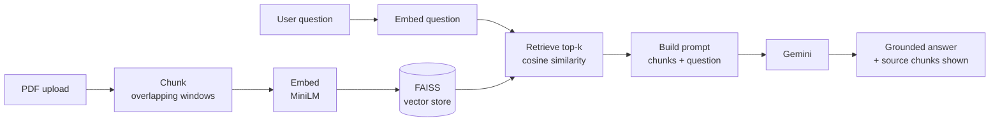

# 📄 RAG Document Q&A Assistant

> Ask questions about any PDF and get answers **grounded in the document** — with the exact source passages shown for every answer.


A from-scratch **Retrieval-Augmented Generation (RAG)** application. Upload a PDF, ask a question, and the app retrieves the most relevant passages and uses them to ground a Gemini-generated answer — then shows you the retrieved chunks and their similarity scores so you can verify the answer.

## The problem
Large language models answer from training memory, so they can't see your private documents and will confidently invent answers (hallucinate) about things they don't know. RAG fixes this by retrieving relevant text from your document at question time and grounding the answer in it.

## How it works
```
PDF → chunk → embed → store (FAISS) → [question] → embed → retrieve top-k → prompt → Gemini → grounded answer
```



## What it demonstrates
- End-to-end RAG built **without** a heavyweight framework — embeddings, a vector store, retrieval, and generation wired together directly, so every step is visible and understood.
- **Cosine-similarity retrieval** using a FAISS inner-product index over L2-normalised embeddings.
- **Grounded generation** with a prompt that instructs the model to answer only from retrieved context and to say so when the answer isn't present.
- **Source transparency**: every answer displays the retrieved chunks, their page numbers, and similarity scores — making hallucination easy to spot.
- Interactive controls for `top-k` and chunk size to explore the retrieval trade-offs.

## Tech stack
- **Python**
- **sentence-transformers** (`all-MiniLM-L6-v2`) — free local embeddings
- **FAISS** — vector store / similarity search
- **Google Gemini** (`gemini-1.5-flash`, free tier) — generation
- **pypdf** — PDF text extraction
- **Streamlit** — UI

## Project structure
```
rag-document-assistant/
├── app.py              # Streamlit UI (upload, ask, show sources)
├── rag_pipeline.py     # core RAG logic: load, chunk, embed, retrieve, generate
├── requirements.txt
├── .gitignore
├── .streamlit/
│   └── secrets.toml    # local API key (gitignored)
└── assets/
    └── screenshot.png  # <-- add a screenshot of the running app here
```

## Run it locally
```bash
git clone https://github.com/Varungupta2003/rag-document-assistant.git
cd rag-document-assistant
python -m venv .venv && source .venv/bin/activate     # Windows: .venv\Scripts\activate
pip install -r requirements.txt

# add your free Gemini key (https://aistudio.google.com/app/apikey)
# either edit .streamlit/secrets.toml, or paste it in the app sidebar at runtime

streamlit run app.py
```

## Deploy (free, public URL)
1. Push this repo to GitHub.
2. Go to [share.streamlit.io](https://share.streamlit.io), connect the repo, set `app.py` as the entry point.
3. In the app's **Settings → Secrets**, add:
   ```
   GOOGLE_API_KEY = "your-key"
   ```
4. Deploy — you get a public URL to share on your CV and LinkedIn.

## Screenshot
<!-- Run the app, upload a PDF, ask a question, screenshot the answer + sources, save as assets/screenshot.png -->


---
**Varun Gupta** — Early-Career AI Engineer · MSc Artificial Intelligence (UEL, 2026)
[LinkedIn](https://www.linkedin.com/in/varun-gupta-6311202a7/) · [GitHub](https://github.com/Varungupta2003) · varungupta.ml@gmail.com
*Right to work in the UK · No sponsorship required.*
